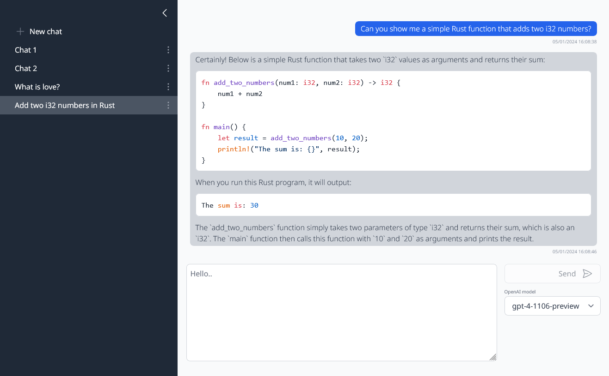

# OpenAI Chat



## Installation

### Prerequisites

- [Rust](https://www.rust-lang.org/tools/install)
- [Node.js](https://nodejs.org/en/download)
- [npm](https://docs.npmjs.com/downloading-and-installing-node-js-and-npm)

### Dependencies

```bash
cargo install sqlx-cli
cargo install cargo-watch
```

```bash
sqlx migrate run
cd client && npm install
```

### Environment Variables

Copy `.env.example` to `.env` and update the variables.

## Usage

### Production

```bash
cd client && npm run build
cargo run
```

And visit [http://localhost:3000](http://localhost:3000).

### Development

```bash
cd client && npm run watch
cargo watch -x run
```

And visit [http://localhost:5173](http://localhost:5173).

Optional:

```bash
sqlx migrate revert
sqlx database reset
```
